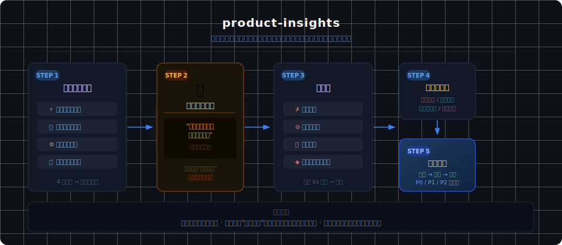

# vibeskills

从日常产品开发实战中提炼的 Claude Code Skills 集合。

每个 skill 是一套可复用的思维框架和操作流程，通过 Claude Code 的 skill 机制直接在项目中使用。

## Skills

| Skill | 说明 |
|-------|------|
| [product-insights](product-insights/) | 对项目进行产品层面的深度洞察，找出产品愿景与当前形态之间的错位，输出可行动的建议 |

### product-insights



## 使用方式

### 方式一：全局安装

将 skill 目录符号链接到 `~/.claude/skills/`：

```bash
ln -s /path/to/vibeskills/product-insights ~/.claude/skills/product-insights
```

之后在任何项目中都可以通过 `/product-insights` 调用。

### 方式二：通过 --add-dir 加载

启动 Claude Code 时指定本仓库路径：

```bash
claude --add-dir /path/to/vibeskills
```

Claude Code 会自动发现 `.claude/skills/` 下的 skill，也可以手动将需要的 skill 目录放入目标项目的 `.claude/skills/` 中。

## Skill 目录结构

每个 skill 遵循 Claude Code 标准结构：

```
skill-name/
└── SKILL.md    # 主文件，包含 frontmatter 和完整指令
```

## License

MIT
